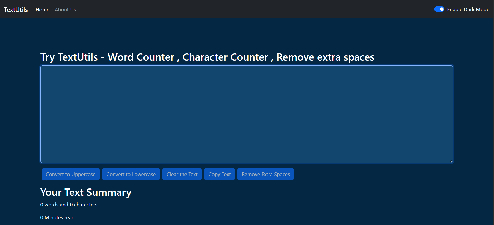

# 📝 TextUtils

TextUtils is a modern React-based web application designed for efficient text manipulation and analysis. It provides multiple utility features that help users quickly transform, manage, and analyze text through a clean, responsive, and user-friendly interface.

## ✨ Features

* 🔠 Convert text to Uppercase and Lowercase
* 🧹 Remove extra spaces instantly
* 📋 Copy text with a single click
* 🗑️ Clear text quickly
* 📊 Word and Character Counter
* ⏱️ Reading Time Estimation
* 🌙 Dark Mode Support
* 📱 Responsive User Interface
* ⚡ Fast and Lightweight Performance

## 🛠️ Tech Stack

### Frontend

* ⚛️ React.js
* ⚡ JavaScript (ES6+)
* 🌐 HTML5
* 🎨 CSS3
* 📦 Bootstrap

## 📂 Modules

* 🔄 Text Transformation
* 📈 Text Analysis
* 📋 Clipboard Functionality
* 🌙 Theme Toggle
* 📱 Responsive Components

## 📸 Preview

<p align="center">
  
</p>

## 🚀 Getting Started

### Clone Repository

```bash
git clone https://github.com/vighneshchiluka/textutils.git
```

### Navigate to Project Directory

```bash
cd textutils
```

### Install Dependencies

```bash
npm install
```

### Start Development Server

```bash
npm start
```

## 🌐 Live Demo

🔗 https://vighneshchiluka.github.io/textutils

## 🎯 Future Improvements

* 🤖 Grammar Correction
* 🎤 Speech-to-Text Support
* 🌍 Text Translation
* 📄 Export Text as PDF
* 📁 File Upload Support

## 👨‍💻 Developer

### Vighnesh Chiluka

🌐 Portfolio: https://vighneshchiluka.netlify.app

💼 LinkedIn: https://www.linkedin.com/in/vighneshchiluka/

🐙 GitHub: https://github.com/vighneshchiluka

This project is created for learning, practice, and portfolio purposes.
